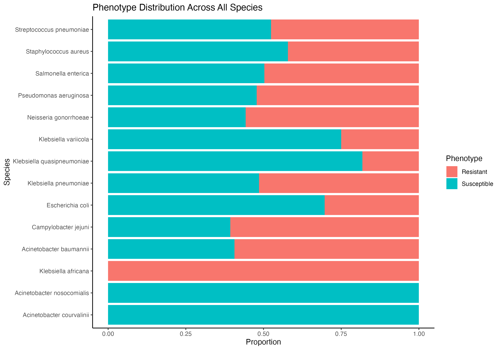
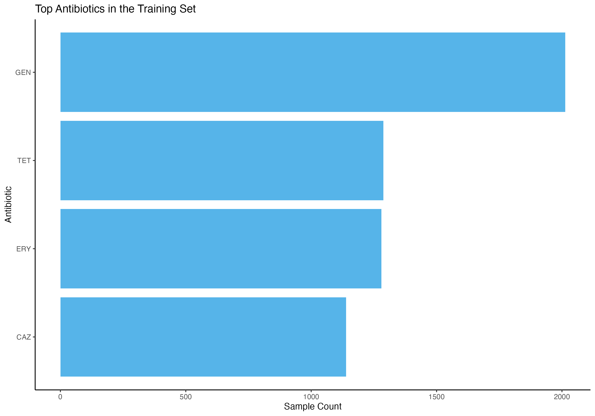

<!-- README.md is generated from README.Rmd. Please edit that file -->

# AMRdb <a href='https://eveliacoss.github.io/AMRdb/'></a>

<!-- badges: start -->

[](https://doi.org/10.5281/zenodo.3960218)
[](https://github.com/EveliaCoss/AMRdb/issues)
[](https://github.com/EveliaCoss/AMRdb/pulls)
[](https://lifecycle.r-lib.org/articles/stages.html#experimental)
[](https://github.com/EveliaCoss/AMRdb/actions/workflows/check-bioc.yml)
[](https://app.codecov.io/gh/EveliaCoss/AMRdb)
<!-- badges: end -->

The goal of `AMRdb` is to provide a curated, high-quality dataset that
supports the analysis, visualization, and modeling of antimicrobial
resistance (AMR). Specifically, AMRdb enables researchers and data
scientists to:

- Analyze outputs from Machine Learning (ML) and Deep Learning (DL)
  models, particularly those related to MIC (Minimum Inhibitory
  Concentration) predictions and phenotypic classification (Resistant,
  Intermediate, Susceptible).

- Explore clinical and genomic metadata associated with microbial
  isolates.

- Integrate structured data into reproducible workflows for
  computational AMR surveillance and comparative genomics.

## Installation instructions

Get the latest stable `R` release from
[CRAN](http://cran.r-project.org/).

``` r
install.packages("AMRdb")
```

To install the development version from [Github](https://github.com)
use:

``` r
if (!requireNamespace("remotes", quietly = TRUE)) {
    install.packages("remotes")
}

remotes::install_github("EveliaCoss/AMRdb")
```

Or you can install `AMRdb` from [Bioconductor](http://bioconductor.org/)
using the following code:

``` r
if (!requireNamespace("BiocManager", quietly = TRUE)) {
    install.packages("BiocManager")
}

BiocManager::install("AMRdb")
```

And the development version from
[GitHub](https://github.com/EveliaCoss/AMRdb) with:

``` r
BiocManager::install("EveliaCoss/AMRdb")
```

## About the data

The data included in this package are sourced from publicly available
repositories such as the [ENA
browser](https://www.ebi.ac.uk/ena/browser/home),
[BV-BRC](https://www.bv-brc.org/), and
[NCBI](https://www.ncbi.nlm.nih.gov/), offering a harmonized foundation
for predictive modeling and downstream resistance profiling.

The `AMRdb` package contains 4 datasets:

``` r
library(AMRdb)
```

### Raw metadata

The first dataset is `training_metadata_db`, which contains the full
unprocessed metadata as originally downloaded from the CAMDA 2025
training set. It preserves all column names, formats, and variable
structures for traceability and cross-referencing. This dataset
complements the cleaned version and supports reproducibility and model
auditability; see `?training_metadata_db` for more details.

``` r
head(training_metadata_db)
#> # A tibble: 6 × 17
#>   genus     species     accession  phenotype   antibiotic measurement_sign
#>   <chr>     <chr>       <chr>      <chr>       <chr>      <chr>           
#> 1 Neisseria gonorrhoeae SRR1661238 Susceptible TET        <NA>            
#> 2 Neisseria gonorrhoeae SRR5827180 Susceptible TET        <NA>            
#> 3 Neisseria gonorrhoeae SRR5827125 Susceptible TET        <NA>            
#> 4 Neisseria gonorrhoeae SRR5827026 Susceptible TET        <NA>            
#> 5 Neisseria gonorrhoeae SRR5827271 Susceptible TET        <NA>            
#> 6 Neisseria gonorrhoeae SRR5827340 Susceptible TET        <NA>            
#> # ℹ 11 more variables: measurement_value <dbl>, measurement_unit <chr>,
#> #   laboratory_typing_method <chr>, laboratory_typing_platform <chr>,
#> #   testing_standard <chr>, testing_standard_year <chr>, publication <chr>,
#> #   isolation_source <chr>, isolation_country <chr>, collection_date <chr>,
#> #   scientific_name_CAMDA <chr>
```

The second dataset is `test_metadata_db`, which includes all original
variables and column names exactly as provided in the CAMDA 2025 test
set.It serves as the benchmark data for validating ML and DL models
built during the challenge. For details on structure and usage, see
`?test_metadata_db`.

``` r
head(test_metadata_db)
#> # A tibble: 6 × 7
#>   genus      species    accession  phenotype antibiotic measurement_value
#>   <chr>      <chr>      <chr>      <chr>     <chr>      <chr>            
#> 1 Klebsiella pneumoniae SRR5386858 ?         GEN        ?                
#> 2 Klebsiella pneumoniae SRR5386458 ?         GEN        ?                
#> 3 Klebsiella pneumoniae SRR5386457 ?         GEN        ?                
#> 4 Klebsiella pneumoniae SRR5386456 ?         GEN        ?                
#> 5 Klebsiella pneumoniae SRR5386454 ?         GEN        ?                
#> 6 Klebsiella pneumoniae SRR5386452 ?         GEN        ?                
#> # ℹ 1 more variable: scientific_name_CAMDA <chr>
```

### Cleaned metadata

The third dataset is `training_db_cleaned`, which contains curated and
preprocessed metadata from the CAMDA 2025 training set
(`training_metadata_db`). Species-level annotations were verified using
the Genome Taxonomy Database (GTDB), based on Average Nucleotide
Identity (ANI) calculated for each SRA accession. Two new columns were
added:

- `scientific_name_new`, the corrected species name inferred from GTDB
- `new_genus`, the revised genus assignment, which can be used in
  downstream steps to reassess MIC interpretations. See
  ?training_db_cleaned for full details.

All relevant variables have been standardized for downstream analysis;
see `?training_db_cleaned` for full details.

``` r
head(training_db_cleaned)
#> # A tibble: 6 × 10
#>   genus     species    scientific_name_new accession genome phenotype antibiotic
#>   <chr>     <chr>      <chr>               <chr>     <chr>  <chr>     <chr>     
#> 1 Neisseria gonorrhoe… Neisseria gonorrho… SRR16612… ENA_S… Suscepti… TET       
#> 2 Neisseria gonorrhoe… Neisseria gonorrho… SRR58271… ENA_S… Suscepti… TET       
#> 3 Neisseria gonorrhoe… Neisseria gonorrho… SRR58271… ENA_S… Suscepti… TET       
#> 4 Neisseria gonorrhoe… Neisseria gonorrho… SRR58270… ENA_S… Suscepti… TET       
#> 5 Neisseria gonorrhoe… Neisseria gonorrho… SRR58272… ENA_S… Suscepti… TET       
#> 6 Neisseria gonorrhoe… Neisseria gonorrho… SRR58273… ENA_S… Suscepti… TET       
#> # ℹ 3 more variables: measurement_value <dbl>, ani <dbl>, new_genus <chr>
```

The fourth dataset is `test_db_cleaned`, derived from the CAMDA 2025
test set (`test_metadata_db`). Accessions shared with the training set
(`training_metadata_db`) were removed to avoid data leakage. GTDB-based
species validation was performed to verify taxonomic annotations. A new
column, `scientific_name_new`, provides the corrected species name for
each sample based on ANI profiling. See ?test_db_cleaned for more
information.

``` r
head(test_db_cleaned)
#> # A tibble: 6 × 9
#>   genus      species   scientific_name_new accession genome phenotype antibiotic
#>   <chr>      <chr>     <chr>               <chr>     <chr>  <chr>     <chr>     
#> 1 Klebsiella pneumoni… Klebsiella pneumon… SRR53868… ENA_S… ?         GEN       
#> 2 Klebsiella pneumoni… Klebsiella pneumon… SRR53864… ENA_S… ?         GEN       
#> 3 Klebsiella pneumoni… Klebsiella pneumon… SRR53864… ENA_S… ?         GEN       
#> 4 Klebsiella pneumoni… Klebsiella pneumon… SRR53864… ENA_S… ?         GEN       
#> 5 Klebsiella pneumoni… Klebsiella pneumon… SRR53864… ENA_S… ?         GEN       
#> 6 Klebsiella pneumoni… Klebsiella pneumon… SRR53864… ENA_S… ?         GEN       
#> # ℹ 2 more variables: measurement_value <chr>, ani <dbl>
```

### Public metadata

The fifth dataset, `antibiograms_db`, contains public antimicrobial
susceptibility data linked to SRA accessions from both the CAMDA 2025
training and test sets. Records were retrieved from ENA, BV-BRC, and
NCBI using a Zenodo reference (version 4, July 4, 2025); see
`?antibiograms_db` for more info:

``` r
head(antibiograms_db)
#> # A tibble: 6 × 14
#>   biosample    sra_biosample scientific_name_Antibiogram antibiotic    phenotype
#>   <chr>        <chr>         <chr>                       <chr>         <chr>    
#> 1 SAMN01163409 SRS362631     Enterobacter cloacae        tetracycline  resistant
#> 2 SAMN01163409 SRS362631     Enterobacter cloacae        chlorampheni… resistant
#> 3 SAMN01163409 SRS362631     Enterobacter cloacae        ampicillin    resistant
#> 4 SAMN01163409 SRS362631     Enterobacter cloacae        gentamicin    suscepti…
#> 5 SAMN01163409 SRS362631     Enterobacter cloacae        colistin      suscepti…
#> 6 SAMN01163409 SRS362631     Enterobacter cloacae        sulfamethoxa… intermed…
#> # ℹ 9 more variables: measurement_sign <chr>, measurement_value <chr>,
#> #   measurement_units <chr>, typing_method <chr>, typing_platform <chr>,
#> #   standard <chr>, genomes <chr>, accession <chr>, read_type <chr>
```

The sixth dataset, `rgi_results`, contains resistance gene features
inferred by RGI for CAMDA 2025 training and test samples. It includes
sample metadata, prediction targets, and gene/SNP-level features labeled
by ARO identifiers. See `?rgi_results` for details.

``` r
head(rgi_results)
#> # A tibble: 6 × 1,076
#>   genus          species     accession phenotype    antibiotic measurement_value
#>   <chr>          <chr>       <chr>     <chr>        <chr>      <chr>            
#> 1 Neisseria      gonorrhoeae DRR124693 Intermediate TET        0.5              
#> 2 Staphylococcus aureus      DRR170693 Intermediate ERY        4.0              
#> 3 Staphylococcus aureus      DRR170697 Intermediate ERY        4.0              
#> 4 Staphylococcus aureus      DRR170701 Intermediate ERY        4.0              
#> 5 Streptococcus  pneumoniae  ERR016633 Resistant    ERY        256.0            
#> 6 Streptococcus  pneumoniae  ERR016635 Resistant    ERY        256.0            
#> # ℹ 1,070 more variables: categoria_recodificada <dbl>, aro3000464_a121d <dbl>,
#> #   aro3000464_g120k <dbl>, aro3003930_v57m <dbl>, aro3004833_l421p <dbl>,
#> #   aro3000816 <dbl>, aro3003961 <dbl>, aro3000533 <dbl>, aro3000535 <dbl>,
#> #   aro3004832_a311v <dbl>, aro3004832_g545s <dbl>, aro3004832_i312m <dbl>,
#> #   aro3004832_f504l <dbl>, aro3004832_t483s <dbl>, aro3004832_v316t <dbl>,
#> #   aro3004832_a510v <dbl>, aro3004832_n512y <dbl>, aro3003928_s91f <dbl>,
#> #   aro3000999 <dbl>, aro3003929_s87r <dbl>, aro3000186 <dbl>, …
```

## Assign MIC categories and interpretive phenotypes by genus

This function is part of the `AMRdb package` and uses the column
`new_genus` to categorize MIC values and assign interpretive phenotypes.
It applies genus-specific breakpoint logic to recategorize
`measurement_value` into standardized MIC bins and determine a phenotype
label (`Susceptible or Resistant`) for each accession.

``` r
training_new_mic_db <- process_mic_values(training_db_cleaned, max_mic = 256)
head(training_new_mic_db)
```

Also, you can specify `64, 256, or 1024` as values for the `max_mic`
argument in `process_mic_values()`. Each option defines a different
resolution for binning MIC values and selecting genus-specific
breakpoints for phenotype assignment.

- `64` is suitable for low-range MICs with coarse categories
- `256` offers intermediate granularity
- `1024` provides high-resolution categorization for datasets with wide
  MIC ranges

## ML and DL input matrix

To support downstream machine learning and deep learning workflows,
AMRdb provides a structured dataset combining phenotype-labeled metadata
and resistance gene features. Specifically, we merged:

- `training_db_cleaned` and `test_db_cleaned`, containing curated sample
  metadata and MIC-based phenotypes
- The gene family matrix derived from the [Resistance Gene Identifier
  (RGI) analysis](https://card.mcmaster.ca/analyze/rgi), sourced from
  `?rgi_results`

The result is a modeling-ready data frame with harmonized metadata and
feature-rich gene/SNP-level annotations indexed by SRA accession. This
matrix can be used directly for classification, feature selection, or
resistance prediction benchmarking.

``` r
str(training_and_test_inputfile_complete[, 1:15])
#> tibble [9,775 × 15] (S3: tbl_df/tbl/data.frame)
#>  $ genus              : chr [1:9775] "Neisseria" "Neisseria" "Neisseria" "Neisseria" ...
#>  $ species            : chr [1:9775] "gonorrhoeae" "gonorrhoeae" "gonorrhoeae" "gonorrhoeae" ...
#>  $ scientific_name_new: chr [1:9775] "Neisseria gonorrhoeae" "Neisseria gonorrhoeae" "Neisseria gonorrhoeae" "Neisseria gonorrhoeae" ...
#>  $ accession          : chr [1:9775] "SRR1661238" "SRR5827180" "SRR5827125" "SRR5827026" ...
#>  $ genome             : chr [1:9775] "ENA_SAMN03201584" "ENA_SAMN07351025" "ENA_SAMN07351011" "ENA_SAMN07351174" ...
#>  $ phenotype          : chr [1:9775] "Susceptible" "Susceptible" "Susceptible" "Susceptible" ...
#>  $ antibiotic         : chr [1:9775] "TET" "TET" "TET" "TET" ...
#>  $ measurement_value  : chr [1:9775] "0.25" "0.12" "0.12" "0.12" ...
#>  $ ani                : num [1:9775] 0.998 0.997 0.997 0.998 0.997 0.998 0.997 0.997 0.997 0.997 ...
#>  $ type               : chr [1:9775] "training" "training" "training" "training" ...
#>  $ phenotype_assigned : chr [1:9775] "Susceptible" "Susceptible" "Susceptible" "Susceptible" ...
#>  $ recategorized_mic  : Factor w/ 13 levels "0.06","0.12",..: 3 2 2 2 3 2 1 3 1 2 ...
#>  $ aro3000464_a121d   : num [1:9775] 0 0 0 0 0 0 1 1 0 0 ...
#>  $ aro3000464_g120k   : num [1:9775] 0 0 0 0 0 0 1 1 0 0 ...
#>  $ aro3003930_v57m    : num [1:9775] 0 0 0 0 0 0 1 1 1 0 ...
```

See `?training_and_test_inputfile_complete` for details.

## Examples

To explore the taxonomic diversity present in the AMRdb metadata, we
summarize the number of unique SRA accessions per **species** across
both the training and test datasets. This overview helps assess sample
coverage and guides downstream modeling decisions.

You can find extended code and visualization examples in
`vignette("examples")`.

``` r
library(tidyverse)

# Count unique accessions per species in the training metadata
train_counts_cleaned <- training_db_cleaned %>%
  group_by(scientific_name_new) %>%
  summarise(trainClean_num_accessions = n_distinct(accession))

# Count unique accessions per species in the testing metadata
test_counts_cleaned <- test_db_cleaned %>%
  group_by(scientific_name_new) %>%
  summarise(testClean_num_accessions = n_distinct(accession))

# Combine the counts by species, keeping all species present in the training set
combined_counts_completed <- train_counts_cleaned %>%
  left_join(test_counts_cleaned, by = "scientific_name_new") 

# sum columns
df_total <- combined_counts_completed %>%
  summarise(across(where(is.numeric), ~sum(.x, na.rm = TRUE))) %>%
  mutate(rowname = "Total") %>%
  select(rowname, everything())

combined_counts_completed <- combined_counts_completed %>%
  mutate(rowname = rownames(.)) %>%
  select(rowname, everything()) %>%
  bind_rows(df_total)

# Display the combined counts table
combined_counts_completed %>% 
  select(-rowname)
#> # A tibble: 15 × 3
#>    scientific_name_new        trainClean_num_accessions testClean_num_accessions
#>    <chr>                                          <int>                    <int>
#>  1 Acinetobacter baumannii                          483                      385
#>  2 Acinetobacter courvalinii                          1                       NA
#>  3 Acinetobacter nosocomialis                         3                       NA
#>  4 Campylobacter jejuni                             537                      408
#>  5 Escherichia coli                                 506                      509
#>  6 Klebsiella africana                                1                       NA
#>  7 Klebsiella pneumoniae                            767                      468
#>  8 Klebsiella quasipneumoniae                        11                       NA
#>  9 Klebsiella variicola                              12                        4
#> 10 Neisseria gonorrhoeae                            741                      558
#> 11 Pseudomonas aeruginosa                           570                      147
#> 12 Salmonella enterica                              640                      619
#> 13 Staphylococcus aureus                            570                      597
#> 14 Streptococcus pneumoniae                         607                      350
#> 15 <NA>                                            5449                     4045
```

With training_db_cleaned, you can explore how resistance **phenotypes**
vary across species and identify which taxa show diverse or consistent
susceptibility patterns. See more examples in `vignette("examples")`.

``` r
training_db_cleaned %>%
  group_by(scientific_name_new, phenotype) %>%
  summarise(count = n(), .groups = "drop") %>%
  pivot_wider(
    names_from = phenotype,
    values_from = count,
    values_fill = 0
  )
#> # A tibble: 14 × 4
#>    scientific_name_new        Intermediate Resistant Susceptible
#>    <chr>                             <int>     <int>       <int>
#>  1 Acinetobacter baumannii             146       248         170
#>  2 Acinetobacter courvalinii             0         0           1
#>  3 Acinetobacter nosocomialis            0         0           3
#>  4 Campylobacter jejuni                  0       326         211
#>  5 Escherichia coli                     19       148         340
#>  6 Klebsiella africana                   0         1           0
#>  7 Klebsiella pneumoniae               133       326         308
#>  8 Klebsiella quasipneumoniae            0         2           9
#>  9 Klebsiella variicola                  0         3           9
#> 10 Neisseria gonorrhoeae               148       336         267
#> 11 Pseudomonas aeruginosa               94       249         228
#> 12 Salmonella enterica                  19       346         350
#> 13 Staphylococcus aureus                46       222         305
#> 14 Streptococcus pneumoniae             53       311         343
```

You can use the unified input file for ML and DL
(`training_and_test_inputfile_complete`) to explore phenotype
distribution across species. Labels include `Susceptible, Resistant`,
and `?` (for test samples without known outcomes). Below is a
species-wise summary found in this file. See extended examples in
`vignette("examples")`.

``` r
training_and_test_inputfile_complete %>%
  group_by(scientific_name_new, phenotype_assigned) %>%
  summarise(count = n(), .groups = "drop") %>%
  pivot_wider(
    names_from = phenotype_assigned,
    values_from = count,
    values_fill = 0
  )
#> # A tibble: 21 × 4
#>    scientific_name_new          `0` Resistant Susceptible
#>    <chr>                      <int>     <int>       <int>
#>  1 Acinetobacter baumannii      385       394         170
#>  2 Acinetobacter courvalinii      0         0           1
#>  3 Acinetobacter nosocomialis     0         0           3
#>  4 Acinetobacter piscicola        1         0           0
#>  5 Acinetobacter schindleri       2         0           0
#>  6 Acinetobacter sp.              3         0           0
#>  7 Bacillus clausii               1         0           0
#>  8 Campylobacter coli             1         0           0
#>  9 Campylobacter jejuni         408       326         211
#> 10 Escherichia coli             509       154         353
#> # ℹ 11 more rows
```

## Graphs

Antimicrobial resistance becomes easier to interpret when you start
visualizing the data. For example:





## Citation

Below is the citation output from using `citation('AMRdb')` in R. Please
run this yourself to check for any updates on how to cite **AMRdb**.

``` r
print(citation('AMRdb'), bibtex = TRUE)
#> To cite package 'AMRdb' in publications use:
#> 
#>   EveliaCoss (2025). _Mi articulo_. doi:10.18129/B9.bioc.AMRdb
#>   <https://doi.org/10.18129/B9.bioc.AMRdb>,
#>   https://github.com/EveliaCoss/AMRdb/AMRdb - R package version 0.1.0,
#>   <http://www.bioconductor.org/packages/AMRdb>.
#> 
#> A BibTeX entry for LaTeX users is
#> 
#>   @Manual{,
#>     title = {Mi articulo},
#>     author = {{EveliaCoss}},
#>     year = {2025},
#>     url = {http://www.bioconductor.org/packages/AMRdb},
#>     note = {https://github.com/EveliaCoss/AMRdb/AMRdb - R package version 0.1.0},
#>     doi = {10.18129/B9.bioc.AMRdb},
#>   }
#> 
#>   EveliaCoss (2025). "Mi articulo." _bioRxiv_. doi:10.1101/TODO
#>   <https://doi.org/10.1101/TODO>,
#>   <https://www.biorxiv.org/content/10.1101/TODO>.
#> 
#> A BibTeX entry for LaTeX users is
#> 
#>   @Article{,
#>     title = {Mi articulo},
#>     author = {{EveliaCoss}},
#>     year = {2025},
#>     journal = {bioRxiv},
#>     doi = {10.1101/TODO},
#>     url = {https://www.biorxiv.org/content/10.1101/TODO},
#>   }
```

Please note that the `AMRdb` was only made possible thanks to many other
R and bioinformatics software authors, which are cited either in the
vignettes and/or the paper(s) describing this package.

## Code of Conduct

Please note that the `AMRdb` project is released with a [Contributor
Code of Conduct](http://bioconductor.org/about/code-of-conduct/). By
contributing to this project, you agree to abide by its terms.

This package was developed using
*[biocthis](https://bioconductor.org/packages/3.21/biocthis)*.
